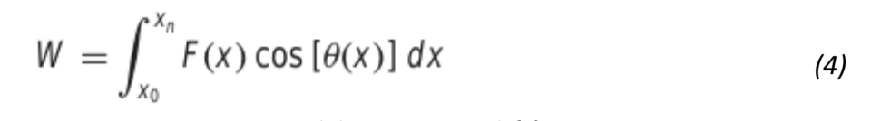
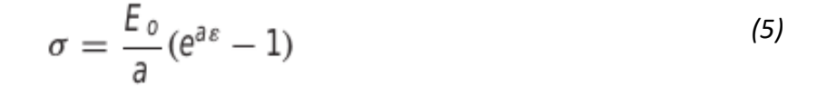

Q1: The general form of a three-dimensional stress field is given by a 2nd order stress tensor as

    σ = [σxx σxy σxz ]
        [σyx σyy σyz ]                            (1)
        [σzx σzy σzz ]

where the diagonal terms represent tensile or compressive stresses and the off-diagonal terms represent
shear stresses. A stress field is given by
      
      σ = [10 14 25]
          [14 7 15 ] × 10^6                       (2)  
          [25 15 16] 
.

Principal stresses (σ1, σ2, σ3 ) are known to be the three eigen values of stress tensor σ. For any given
stress tensor σ, it is essential to construct the following matrix

         [10 − σ    14        25    ]
         [  14    7 − σ       15    ] × 10^6
         [  25     15      16 − σ   ] 
.

Such that σ1, σ2, σ3 can be solved from the equation

σ3 − Iσ2 + IIσ − III = 0    &nbsp;&nbsp;&nbsp;&nbsp;&nbsp;&nbsp;&nbsp;&nbsp;&nbsp;&nbsp;&nbsp;&nbsp;&nbsp;&nbsp;&nbsp;&nbsp;(3)

where

I = σxx + σyy + σzz

II = σxxσyy + σxxσzz + σyyσzz − σ2xy − σ2xz − σ2yz

III = σxxσyyσzz − σxxσ2yz − σyyσ2xz − σzzσ2xy + 2σxyσxzσyz.

I,II,III are known as first invariant, second invariant and third invariant of stress tensor. For a given
stress tensor σ in Equation (2), find the three roots of Equation (3) as first principal stress (σ1), second
principal stress (σ2) and third principal stress (σ3) using any of the root finding technique you have
learnt by making a its python code. An inequality of the form σ1 > σ2 > σ3 is considered to decide the
first principal stress (σ1), second principal stress (σ2) and third principal stress (σ3). This python code
should ask the user to input value of 6 components σxx, σyy,σzz, σxy, σxz and σyz of stress tensor, while
the remaining three components can be obtained due to symmetric nature of stress tensor.

Q2: Write a python code or use in-build python functions to use a continuous Fourier series to
approximate the wave form shown in Fig. 1.

Q3: The work equation is given as function of force F(x) and angle θ(x) between force and the distance
of movement (x) as:

                                      
where xo and xn is taken as 0 and 30 respectively. The F(x) and angle θ(x) variation with respect to
distance of movement (x) is given by following two equations as:

F(x)= 1.6x-0.045x2

θ(x)= 0.8 + 0.125x -0.009x2 + 0.0002x3

(a) Make a python code or use in-build python functions to compute the integral in equation (4) using
4-, 8- and 16- segment trapezoidal rules.

(b) Extend the python code developed in (a) or use in-build python functions to compute the integral in
equation (4) using simpson's 1/3 rule.

(c) Extend the python code developed in (b) or use in-build python functions to compute the integral in
equation (4) using Romberg integration to εs=0.5%.

(d) Extend the python code developed in (b) or use in-build python functions to compute the integral in
equation (iv) using gauss quadrature.

At the end your code should print values of integral in following format:

Trapezoidal 4: integration value

Trapezoidal 8: integration value

Trapezoidal 16: integration value

Simpson1/3: integration value

Romberg: integration value

Quadrature: integration value

Q4: Soft tissue follows an exponential deformation behavior in uniaxial tension while it is in the
physiologic or normal range of elongation. This can be expressed as:

where σ = stress, ε = strain, and Eo and a are material constants that are determined experimentally.
To evaluate the two material constants, the above equation is differentiated with respect to ε, which is
a fundamental relationship for soft tissue

To evaluate Eo and a, stress-strain data is used to plot dσ/dε versus σ and the slope and intercept of
this plot are the two material constants, respectively. The following table contains stress-strain data
for heart chordae tendineae (small tendons use to hold heart valves closed during contraction of the
heart muscle). This is data from loading the tissue; different curves are produced on unloading.

(a) Calculate the derivative dσ/dε using finite differences (using inbuilt function of python) that are second-
order accurate. Plot the data and eliminate the data points near the zero points that appear not to follow the
straight-line relationship. The error in this data comes from the inability of the instrumentation to read the small
values in this region. Perform a regression analysis (using inbuilt function of python) of the remaining data
points to determine the values of Eo and a. Plot the stress versus strain data points given in the above table
along with the analytic curve expressed by the equation (5) using constants value Eo and a obtained after
regression analysis in the same plot. This will indicate how well the analytic curve matches the data. In the
plot, differentiate between two curves thus obtained by using different line type (dash --, solid -) having blue
color.
